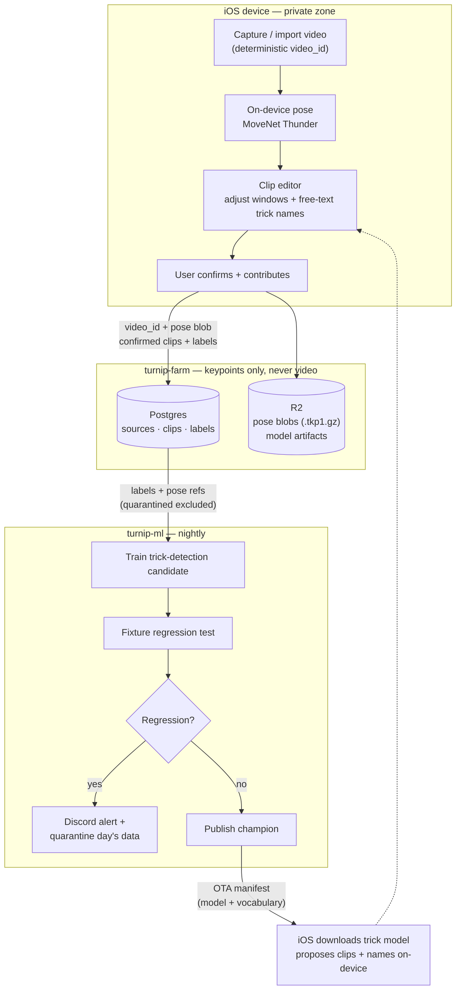

# Turnip Farm + ML Master Plan

*Rev 3 · 2026-10-05 · Draft for review.*

*Rev 1 established the direction. Rev 2 incorporated the maintainer's
gap-review decisions (confirmed contribution flow, TKP1 format, output contract,
vocabulary versioning, quarantine design, phasing, overview diagram).
Rev 3 makes source/clip IDs deterministic (derived, not random) so they
survive app reinstalls, and adds the reinstall reconciliation flow.*

This document is the master plan for `turnip-farm` (backend + dataset) and
`turnip-ml` (training), and the contract they hold with `turnip-ios`.
It **supersedes** the backend, labeling, and ML sections of
`turnip-ios/docs/DESIGN.md` (Rev 8) on the points listed in §8, and
records three direction changes the maintainer made on 2026-10-05:

1. **Community labeling with free-text trick names.** Users label their
   clips; labels are free-text, the UI prompts for the trick name, and a
   clip can carry multiple labels (e.g. a combo: `hook`, `scoot`,
   `gainer`, `cartfull`).
2. **Privacy-first farm: no video, ever.** Clips are never sent to the farm
   as video data. What leaves the device is an opaque video identifier plus
   the pose keypoint sequence. The iOS client matches server-side label data
   back to local videos using the video identifier.
3. **The ML engine trains a trick detection model, not a pose model.** The
   model takes a pose key sequence and answers *where the tricks are*
   (start/end frame of each trick) and *what they are called* (trick names).
   Eventually it runs on-device, turning the pose stream directly into a
   list of named clips.

`turnip-ios` remains the capture / pose / clip / export app. Pose detection
itself stays on-device (MoveNet Thunder, bundled) — the farm and the ML
pipeline never see a pixel.

## Overview



Video pixels never cross the device boundary — only the pose keypoint
sequence, opaque identifiers, and confirmed labels travel to the farm.
The loop is closed: better labels → better model → better on-device
proposals → easier labeling.

The confirmed contribution flow (no drafts on the server):

1. User creates clips and labels them using Turnip's detection model,
   or manually, on-device.
2. User confirms the clips and labels, on-device.
3. The confirmed clips and labels are sent to the farm and persisted.
   If clip IDs match existing ones, the labels are overridden (upsert).
4. The farm runs nightly ML jobs and publishes the detection model.
5. iOS clients check for model updates periodically and download them.
6. Repeat from 1.

## 1. Privacy architecture

This is the keystone. Everything else follows from it.

**Never leaves the device:** video pixels, audio, location, photo-library
identifiers, device identifiers, contacts, or anything derived from them.

**May leave the device (per explicit per-clip opt-in):**
- `video_id` — an opaque, **deterministic** identifier derived on-device
  (see §2): for Photos-backed videos,
  `SHA-256("turnip:phasset:" + PHAsset.localIdentifier)`; for imported
  files, `SHA-256(file bytes)`. Deterministic — not random — so the ID
  survives app reinstalls (the localIdentifier belongs to the Photos
  library, not the app). Still opaque to the server: non-reversible, and
  not derivable from video bytes by anyone without the Photos entry, so
  it cannot be joined against outside video datasets. One ID per source
  video. Side benefit: re-contributing the same video upserts instead of
  duplicating training data.
  Caveat: for imports the ID is `SHA-256(file bytes)`, so two users
  importing the identical file compute the identical `video_id` —
  joinable against identical files (which is also what enables the dedup
  side-benefit).
- Pose keypoint sequence — per sampled frame, the model's keypoints
  (`x`, `y`, `confidence`, normalized). A stick figure: no face, no
  background, no clothing, no identity.
- Label payloads — confirmed clip windows (frame ranges) and free-text
  trick names.
- Account subject — the Sign in with Apple `sub` claim, which is already
  per-app opaque. Needed to attribute labels for reputation scoring and
  for quarantine attribution (§6).

**Why keypoints are safe enough:** a pose sequence contains no biometric
image data. Residual honesty: gait-from-keypoints is a real (if nascent)
research area, so we store the minimum viable representation (keypoints
only, no raw sensor data) and keep accounts pseudonymous. No mitigation
beyond minimization is warranted at this scale.

**What this kills from DESIGN.md Rev 8:** presigned video upload to R2,
server-side video storage, server-rendered video feed, and every sentence
with "upload the video to the backend" in it. R2 stays — for pose blobs
and model artifacts, not video.

## 2. Data model (farm)

Postgres. Additive migrations via `dbmate` from day 1 (unchanged
convention). Identity rule: **`sources.id` is the deterministic
`video_id` derived on-device per §1** — the farm never mints source
identities, which is what makes client↔server matching and idempotent
re-submission work. `clips.id` is client-minted (UUIDv4) once and
recovered from the server after reinstall (§5.1), not re-derivable.
All writes below are upserts on ID match.

**ID stability.** Random IDs would die with the app's local store on
reinstall, orphaning the server-side data. So IDs are deterministic:
`sources.id` is derived per §1 (stable across reinstalls via the Photos
library identity or file bytes); `clips.id` is recovered from the
server, not recomputed — on a fresh install the client recomputes its
video_ids, calls `GET /api/sources/:id`, and adopts the returned clip
IDs into its rebuilt local state. Videos deleted from the library stay
on the server as training data; the client simply cannot relink them.

- `users` — `id`, `apple_subject` (unique), `display_name` (optional),
  `reputation`, `is_blocked`, `created_at`. Holds no personal data
  beyond what Apple gives us.
- `sources` — one row per contributed source video. `id` CHAR(64)
  (SHA-256 hex digest per §1, PK), `user_id` FK, `frame_count`,
  `sample_rate` (as sent, provenance), `keypoint_format`
  (e.g. `tkp1`, versioned), `r2_key` (pose blob), `sha256` (hex
  digest of the blob — integrity check, consistent with the model
  manifest's checksum), `created_at`, `updated_at`. No video bytes.
  No thumbnails.
- `clips` — `id` UUID (client-minted once, PK — recovered from the
  server after reinstall, not re-derivable), `source_id` FK,
  `start_frame`, `end_frame`, `auto_detected` (bool: heuristic now,
  trick model later), `created_at`, `updated_at`.
  Hierarchy: **Source → Clip → Label**, all one-to-many.
- `labels` — `id`, `clip_id` FK **UNIQUE** (exactly one label set per
  clip — re-submission overrides), `user_id` FK (owner/labeler, for
  attribution), `labels TEXT[]` (free-text trick names, **multiple per
  clip**), `start_frame` / `end_frame` (nullable — null means "the clip
  window"; the labeler may tighten it), `taxonomy_version` (vocab in
  effect at label time), `created_at`, `updated_at`. `crop_rects` are
  gone: with keypoints the athlete's location is already known, and
  crop is a client-side rendering concern.
- `label_taxonomy` — `raw` → `canonical` mapping, `taxonomy_version`
  (monotonic int, bumped when canonical names are added/changed),
  `first_seen`. Free text is preserved forever; training consumes
  canonical names. Seeded from standard tricking vocabulary.
- `models` — `id`, `version`, `model_type` (`trick-detection`),
  `taxonomy_version` (the vocab the model trained on), `r2_key`,
  `val_metrics` (JSONB), `promoted_at`.
- `data_quarantine` — `id`, `source_id` FK, `user_id` FK (who uploaded
  it — the "basic level of identification" for bad data), `reason`,
  `metrics` (JSONB snapshot), `quarantined_at`, `reviewed_at`,
  `resolution` (`released` | `purged`). The training export excludes
  quarantined sources. This is the anti-poisoning work queue (§6).
- `reports` — retargeted at labels/clips (was: videos).
- `follows` / feed — **deferred**. A server video feed cannot exist
  without server video. Social sharing stays where DESIGN.md put it:
  the iOS Share Sheet, zero server involvement.

## 3. Pose interchange format (`TKP1`)

The canonical encoding for pose keypoint sequences, on the wire and in
R2. One format, versioned — no JSON variant (clients may log JSON
locally, but the wire/storage format is binary).

**Temporal conventions:**
- Canonical sample rate: **10 Hz**. Clients send at their analysis rate
  (the iOS setting, 1–30, default 10); the farm **resamples to 10 Hz on
  ingest** and stores canonical only. `sample_rate` on the source row
  records the as-sent rate for provenance.
- Resampling: linear interpolation of `x`/`y`; confidence interpolated
  linearly. **Gaps break interpolation** — if either bracketing frame is
  a gap, the resampled frame is a gap. Never synthesize pose across
  missing data.

**Keypoint conventions (MoveNet 17, COCO order):**
`0 nose, 1 left_eye, 2 right_eye, 3 left_ear, 4 right_ear,
5 left_shoulder, 6 right_shoulder, 7 left_elbow, 8 right_elbow,
9 left_wrist, 10 right_wrist, 11 left_hip, 12 right_hip,
13 left_knee, 14 right_knee, 15 left_ankle, 16 right_ankle.`

**Spatial conventions:** `x`, `y` normalized 0–1 relative to source
frame dimensions (values may fall outside [0,1] in letterbox-pad regions
— recorded as-is, never clamped, per the iOS convention). `confidence`
0–1 per keypoint, as emitted by the model.

**Gap representation:** a frame with no usable pose is all zeros
(`x=0, y=0, confidence=0` for all 17 keypoints). Consumers treat any
all-zero-confidence frame as missing. Fixed-size, no special-casing in
the binary layout.

**Binary layout** (whole blob gzip-compressed):

```
offset  size  field
0       4     magic "TKP1"
4       2     format_version (uint16, =1)
6       2     keypoint_count (uint16, =17)
8       4     frame_count (uint32)
12      4     sample_rate_hz (float32, canonical 10.0)
16      4     source_sample_rate_hz (float32, as sent)
20      4     flags (uint32, reserved = 0)
24      …     frame_count × 17 × 3 float32 LE (x, y, confidence)
```

Size: 24 + `frame_count` × 204 bytes → ~2 KB/s at 10 Hz; a 60-second
session is ~122 KB.

## 4. API (farm)

Bun + TypeScript + Postgres (unchanged stack). Auth via Sign in with
Apple (unchanged contract). `sources.id` is the §1 SHA-256 hex digest;
`clip_id`s are client-minted UUIDs; every write is an upsert on ID
match.

- `POST /api/sources` — submit a confirmed contribution. Body:
  `{video_id, frame_count, sample_rate, keypoint_format,
  clips: [{clip_id, start_frame, end_frame, auto_detected,
  labels: ["cork", ...]}]}` plus the pose blob via presigned R2 PUT.
  Upload the **full source pose sequence once**; clips are frame
  windows into it. Re-submission with matching IDs overrides
  clips/labels (idempotent).
- `POST /api/clips/:id/labels` — label-only update (re-label without
  re-uploading the source): `{labels, start_frame?, end_frame?}`.
  Upsert on `clip_id`.
- `GET /api/sources` — list your own sources (id, frame_count,
  clip/label counts, updated_at) for the reinstall reconciliation UI.
- `GET /api/sources/:id` — fetch your own source with its confirmed
  clips + labels, matched by `video_id` (device restore /
  cross-device). This is the "client matches server label data using
  the video identifier" mechanism.
- `GET /api/sources/:id/pose` — owner-only presigned R2 GET of the
  source's TKP1 pose blob. Used by a device that no longer holds the
  local video (reinstall restore, cross-device) to render skeleton
  previews from keypoints alone (§5.5). Presigned per request, scoped
  to the single blob, short-lived; the owner-only rule is what keeps
  one user's pose sequences from ever being downloadable by another.
- `DELETE /api/sources/:id` — owner-only hard delete (row + R2 blob).
  Same "keep forever, user-deletable" retention posture.
- `GET /api/models/current` — trick-model manifest: version, URL,
  checksum, `taxonomy_version`, and the vocabulary list
  `[{canonical, aliases[]}]`.
- `POST /api/models` — training pipeline publishes the champion
  (admin-scoped).
- `GET /api/labels/export?since=` — training pipeline pull: labels +
  pose blob references since a watermark. **Excludes quarantined
  sources.**
- `POST /api/reports` — report a bad label/clip.

Dropped from the Rev 1 draft: `GET /api/labels/pending` — there is no
community labeling queue; labeling happens on-device by the clip owner
(per the confirmed contribution flow, the farm has no interest in
draft clips).

## 5. iOS app contract (turnip-ios)

1. **Video identity (deterministic).** Derive `video_id` per §1 — from
   the PHAsset localIdentifier for Photos-backed videos, from file
   bytes for imports. No local ID↔asset mapping to lose: the ID is
   recomputable after a reinstall. Reinstall reconciliation: enumerate
   the Photos library → recompute video_ids → `GET /api/sources` to
   show previously contributed videos → `GET /api/sources/:id` to pull
   confirmed clips + labels and rebuild local state, adopting the
   server's clip IDs.
2. **Clip editor (where labeling lives).** The detector (heuristic now,
   trick model later) proposes clip windows, or the user creates them
   manually. The user adjusts windows and adds **free-text trick names —
   the UI prompts for the trick name and accepts multiple labels per
   clip** — then confirms.
3. **Contribution (on confirm, opt-in).** Upload `{video_id, pose key
   sequence, confirmed clips + labels}`. Keypoints, never video. The
   farm upserts on ID match, so re-confirmation is safe.
4. **Model updates.** Poll `GET /api/models/current` periodically;
   download the trick-detection Core ML model; run it over pose
   sequences to propose clips **and** trick names. The heuristic
   detector stays as the offline fallback.
5. Rendering a skeleton when the local video is absent (e.g. restored
   labels on a new device): the client fetches the pose blob through
   `GET /api/sources/:id/pose` (owner-only, §4) and renders the skeleton
   straight from the TKP1 frames — no video needed. The rendering
   itself is a property of the format; the download path is the new
   endpoint above.

## 6. ML program (turnip-ml)

**Task.** Temporal trick detection + naming. Input: pose key sequence
(`T × 17 × 3`, canonical 10 Hz TKP1). Output per source:

```json
{
  "source_id": "<sha256-hex>",
  "tricks": [
    {"start_frame": 120, "end_frame": 175,
     "trick_names": ["cork"], "is_combo": false},
    {"start_frame": 300, "end_frame": 420,
     "trick_names": ["hook", "scoot", "gainer", "cartfull"],
     "is_combo": true}
  ]
}
```

- Frames are in **source coordinates** — absolute indices into the
  source's canonical 10 Hz pose sequence (not clip-relative).
- `is_combo` is `trick_names.length > 1`, kept as an explicit field for
  client convenience (display, routing). A combo is **one segment with
  N names** — no sub-segmentation for MVP.
- Training target: one segment per confirmed clip window; combo clips
  carry their N canonical names on the single window.

**Data.** `GET /api/labels/export?since=` → (pose blob, clip windows,
free-text labels). Curation: normalize raw strings to canonical names
via `label_taxonomy` (a combo string like
`"hook - scoot - gainer - cartfull (combo)"` splits into four canonical
labels on one window); raw strings never discarded. Non-labeled regions
of contributed sources serve as background negatives.

**Splits.** 80/10/10 stratified by `user_id` — no user's clips leak
across splits. Held-out set stays admin-curated. Bootstrap guard: until
the contributor pool exceeds ~20 users (or any split would hold fewer
than 50 clips), fall back to unstratified random splits —
user-stratification on a handful of contributors yields degenerate
splits (one user dominating all three, or near-empty val/test).

**Model.** Baseline: temporal encoder (TCN or small Transformer) over
the keypoint sequence with a detection head; sliding-window classifier
+ NMS is an acceptable MVP. Architecture choice belongs in the
training plan — the contract is the input/output framing above.

**Metrics.** Segment quality (mAP at tIoU thresholds) **and** name
accuracy, reported separately. Champion/challenger: promote only on
≥1% validation improvement.

**Anti-poisoning (nightly).** After training a candidate, run the
fixture regression suite (the existing pose-accuracy fixtures plus
trick-labeled fixtures — segment IoU + name accuracy vs. champion):
- On regression: (1) fire a **Discord webhook alert** with the metrics
  delta, affected source IDs, and user IDs; (2) **quarantine that day's
  ingested sources** (`data_quarantine`) and skip them in training;
  (3) skip promotion.
- The engineer reviews the quarantine queue, cleans (purge bad
  sources, release good ones); the next night retries.
- Attribution comes from `sources.user_id` — the basic identification
  of who uploaded the bad data.

**Export + deploy.** `coremltools` → Core ML, upload to R2,
`POST /api/models` with the `taxonomy_version` it trained on. The app
picks it up via the existing OTA poll.

**What stays.** The `PoseAccuracy` harness and CI gate now guard the
*input* to the trick model (pose quality on real footage). Fine-tuning
MoveNet itself is off the table unless the pose escalation ladder in
the iOS design doc fires on empirical grounds.

**Trigger.** Nightly cron or manual dispatch; run only when new labels
since the last watermark exceed a threshold (start: 50).

## 7. Phased rollout

- **Phase 0 — foundation (this PR).** Master plan agreed; the doc is
  the contract.
- **Phase 1 — farm ingest.** Tables, `POST /api/sources` (+ upsert),
  pose blob pipeline, labels export, quarantine table, Discord hook
  config.
- **Phase 2 — iOS contribution.** Deterministic video IDs +
  reinstall reconciliation (§5.1), pose upload on confirm, free-text
  multi-label editor in the clip flow.
- **Phase 3 — ML training.** Nightly job, fixture regression suite,
  quarantine flow, taxonomy curation, model publish + OTA manifest.
- **Phase 4 — on-device trick model.** OTA download, on-device clip +
  name proposals, heuristic detector as fallback.

## 8. Suggested changes to turnip-ios DESIGN.md

Suggestions for the maintainer to apply to `docs/DESIGN.md` (Rev 8); this PR
does not touch that file.

1. **Backend section** — replace the video-upload/R2-video design with
   §2–§4 of this plan (`sources`, pose blobs, no video bytes). Delete
   every "upload the video" sentence.
2. **Labels** — free-text `TEXT[]`, multiple per clip, labeler-settable
   windows; drop `crop_rects` from the server label model.
3. **ML section** — the pipeline trains a trick detection model
   (pose sequence → segments + names), not a fine-tuned pose model.
4. **Decisions** — #2 (*no classifier at launch*) is reversed: the
   detector **is** the ML program now. #4 (*keep videos forever*) is
   moot: there are no videos to keep. Add a privacy decision:
   *keypoints + opaque IDs only, never pixels* (§1), reopenable only
   by deliberate product decision, never convenience.
5. **OTA models** — two-model story: bundled MoveNet (pose, unchanged)
   + OTA trick-detection model (replaces the old "pose+action model"
   language).
6. **Clip editor / labeling** — the label editor lives in the clip
   confirmation flow: prompt for the trick name, multi-label chips,
   confirm-to-contribute. No server labeling queue.
7. **New section: video identity** — deterministic video IDs
   recomputed from the Photos library
   (`SHA-256("turnip:phasset:" + localIdentifier)`) or file bytes, no
   local ID↔asset mapping to lose; reinstall reconciliation via
   `GET /api/sources` + `GET /api/sources/:id` (§5.1).
8. **Social feed** — either defer it explicitly (recommended: Share
   Sheet already covers sharing) or restate it as client-rendered
   skeleton previews. The current server-feed design is incompatible
   with §1.
9. **Problem statement** — the "community labeling + continuous
   training platform" paragraph should now say the community trains
   *trick detection*, and the privacy claim should read "no video
   pixels ever leave the device" — pose keypoint sequences, labels,
   and the Apple `sub` do leave per explicit opt-in (§1), and
   gait-from-keypoints re-identification is real research.

## 9. Open questions

1. **Taxonomy curation.** Who canonicalizes new free-text names?
   Proposal: seed from standard tricking vocabulary; fuzzy-match
   suggestions in the label editor; a trusted-user queue resolves the
   unmatched remainder. (Versioning itself is decided — §2/§6.)
2. **Multi-device.** A `video_id` created on the iPhone won't resolve
   on the user's iPad. `GET /api/sources/:id` restores clips + labels;
   video stays behind. Acceptable for v1?
3. **Reputation without video.** The existing reputation/spot-check
   design transfers unchanged (it scores *labels*, never footage) —
   plus quarantine attribution via `sources.user_id`.
